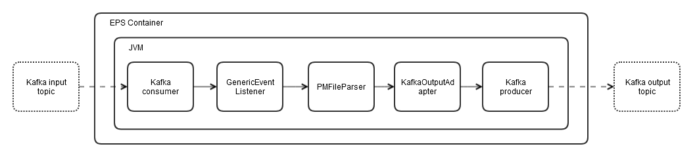

= Event Data Collector - Application Developer Guide

:author: Donnacha Bushe
:doc-name: Event Data Collector Service - Application Developer Guide
:doc-no: 1/198 17-CAV 101 049/1
:revnumber: A
:revdate: {sys: date +%Y-%m-%d}
:approved-by-name: Mohamed Ibrahim C
:approved-by-department: BDGSBECA

== Function Overview
The *Event Data Collector* service is used for event parsing and
processing. It works with Cell Trace Record (CTR) Recording Output
Period (ROP) events that are recorded in CTR ROP files.
The flow is as follows:

1.  Processed CTR ROP files are added to a *Message Bus KF* input topic
that stores the paths to the ROP files on the NFS.
2.  The *Event Data Collector* consumes the CTR ROP file paths on the
input topic, decodes the CTR events, and pushes the CTR events to the
*Message Bus KF* output topic.
1.  It references the *CM Mediator* to filter by CTR event.
2.  It references the relevant schemas in *Schema Registry SR* to
serialize the CTR events.
3.  The *Message Bus KF* output topic receives the CTR events.

== Interface Description
The Event Data Collector interfaces with the following components:

- Kafka topics
- Shared Storage
- Schema Registry
- CM Mediator

The figure shows the component process:

=== Kafka Input Topic

The Kafka Input topic stores records in json format. Each record contains
 a single path to a rop file:
....
{"path":"/path/to/the/ctr/rop/file/mounted/in/this/container.bin.gz"}
....

Additional parameters can be specified in the json record, However they are ignored
by the Event Data Collector.

=== Kafka Output Topic
The Event Data Collector publishes the decoded events on the Kafka output topic in Apache
Avro format using the schemas in Schema Registry.

=== Schema Registry

This service provides the Avro schemas required for serialization of the decoded events.

=== CM Mediator
To use filtering based on CM Mediator for run-time configuration updates of event filter lists, refer to <<Config_Event_Filter_List, Configure Event Filter List for CM Mediator>>.

== Configuration

You can configure the *Event Data Collector* by providing the required formatted data
in `values.yaml`. The formatted data represents the content of the configuration files.
The *Event Data Collector* internally uses Kubernetes ConfigMaps to convert the data
into configuration files. This chapter specifies the configuration values for the
following files:

* flow.xml
* Integration Point Library configuration files +
** Subscriber
** Publisher
** CM Subscriber
* Event list
* logback.xml

[[Config_Flow_XML_File]]
=== Configuration Values for the flow.xml File

The flow descriptor (`flow.xml`) is an XML document that is the central
interface for using the *Event Data Collector*. It provides a declarative
way of designing processing pipelines. It references EPS components and
describes the event flow. It provides a declarative way of designing processing pipelines. It references EPS components and describes the event flow. The flow descriptor is defined by the Flow Framework. The Event Data Processor uses the flow descriptor to determine the following:

* The source of the input events and the destination of the output
events (IO Adapters input/output nodes)

* The components performing event processing (step nodes)
* The connections between the event processing components (path nodes)

The following is the xml string for the `ctr-parser.flow.flow.xml`
configuration parameter in `values.yaml`.
----
<?xml version="1.0"?>
<?xml-stylesheet type="text/xsl" href="configuration.xsl"?>
<FlowDefinition xmlns:oc="urn:com:ericsson:schema:xml:oss:oss_common" xmlns="urn:com:ericsson:schema:xml:oss:fbp_flow" oc:ns="com.ericsson.oss.services" oc:name="EsnSolutionSet" oc:version="1.0.0">
<oc:modelCreationInfo author="easchud" creationDate="10/07/2018">
<oc:designedModel componentId="avroParserEps"/>
</oc:modelCreationInfo>
<oc:desc>Parse input CTR files and filter out the desired decode events to kafka output topic.</oc:desc>

  <input name="kafkaInputAdaptor">
	<attribute name="uri" value="generic:/" />
	<attribute name="integration.point.uri" value="local:///ericsson/apeps/flow" />
	<attribute name="integration.point.name" value="SUBSCRIBER_INTEGRATION_POINT" />
  </input>

  <input name="cmMediatorKafkaInputAdaptor">
	<attribute name="uri" value="generic:/" />
	<attribute name="integration.point.uri" value="local:///ericsson/apeps/flow" />
	<attribute name="integration.point.name" value="CMMEDIATOR_SUBSCRIBER_INTEGRATION_POINT" />
  </input>

  <output name="kafkaOutputAdapter">
	<attribute name="uri" value="avro:/"/>
	<attribute name="integration.point.uri" value="local:///ericsson/apeps/flow" />
	<attribute name="integration.point.name" value="PUBLISHER_INTEGRATION_POINT" />
  </output>

  <step name="pmFileParser">
	<handler>
	  <className>com.ericsson.component.aia.services.exteps.eh.parser.PMFileParser</className>
	</handler>
	<attribute name="schematype" value="celltrace"/>
	<attribute name="decodedEventType" value="generic_record"/>
	<attribute name="eventFilterPath" value="http://eric-cm-mediator:5003/cm/api/v1/configurations/eventlist"/>
  </step>

  <path>
	<from uri="kafkaInputAdaptor"/>
	<to uri="pmFileParser" />
	<to uri="kafkaOutputAdapter" />
  </path>
  <path>
	<from uri="cmMediatorKafkaInputAdaptor"/>
	<to uri="pmFileParser" />
  </path>
</FlowDefinition>

----

=== Node: IO Adapter

IO adapters send and receive events from remote processes. Input adapters act as the source
of data into the flow.  Output adapters send data outside the flow. The default flow has
two input adapters, the `kafkaInputAdaptor` and the `cmMediatorKafkaInputAdaptor`.

The `kafkaInputAdaptor` specifies where to find the Kafka configuration for consuming the
path event. It links to <<Config_IPL_Subscriber_File, Configuration Values for the IPL Subscriber File>>.

The `cmMediatorKafkaInputAdaptor` specifies where to find the Kafka configuration for
 consuming the event filter list. It links to <<Config_IPL_Publisher_File,Configuration
Values for the IPL Publisher File>>.
----

<input name="kafkaInputAdaptor">
  <attribute name="uri" value="generic:/" />
  <attribute name="integration.point.uri" value="local:///ericsson/apeps/flow" />
  <attribute name="integration.point.name" value="SUBSCRIBER_INTEGRATION_POINT" />
</input>

<input name="cmMediatorKafkaInputAdaptor">
  <attribute name="uri" value="generic:/" />
  <attribute name="integration.point.uri" value="local:///ericsson/apeps/flow" />
  <attribute name="integration.point.name" value="CMMEDIATOR_SUBSCRIBER_INTEGRATION_POINT" />
</input>

----

The default flow.xml has one output adapter, `kafkaOutputAdapter.`
----
<output name="kafkaOutputAdapter">
  <attribute name="uri" value="avro:/"/>
  <attribute name="integration.point.uri" value="local:///ericsson/apeps/flow" />
  <attribute name="integration.point.name" value="PUBLISHER_INTEGRATION_POINT" />
</output>
----
The following table describes the main configuration parameters for IO
Adapter nodes:

[width="99%",cols="25%,40%,35%",options="header",]
|=======================================================================
|Parameter |Description |Default
a|
....
name
....

 a|
 The name of the IO Adapter. This name must be unique within the flow.
 Use these values for the `uri` parameter in the path definition.
 |

a|
....
uri
....

 |The protocol that the adapter is able to understand. a|
For `kafkaInputAdapter` and `cmMediatorKafkaInputAdapter`, use `generic:/`

For `kafkaOutputAdapter`, use `avro:/`

a|
....
integration.point.uri
....

 |The path to the folder containing the Integration Point Library
configuration file. a|
....
local:///ericsson/apeps/flow
....

a|
....
integration.point.name
....

 |The name of the Integration Point Library configuration file. a|
* For `kafkaInputAdapter`, use `SUBSCRIBER_INTEGRATION_POINT`
* For `cmMediatorKafkaInputAdapter`, use `CMMEDIATOR_SUBSCRIBER_INTEGRATION_POINT`
* For `For kafkaOutputAdapter`, use `PUBLISHER_INTEGRATION_POINT`

|=======================================================================

=== Node: Step

The step node includes one or more handlers plus additional attributes
that are required by the handler.

The default `flow.xml` specifies one step, `pMFileParser`.

----
<step name="pMFileParser">
    <handler>
        <className>com.ericsson.component.aia.services.exteps.eh.parser.PMFileParser</className>
    </handler>
    <attribute name="schematype" value="celltrace"/>
    <attribute name="decodedEventType" value="generic_record"/>
    <attribute name="eventFilterPath" value="http://eric-cm-mediator:5003/cm/api/v1/configurations/eventlist"/>
</step>
----

The following table describes the main configuration parameters for step
nodes:

[width="100%",cols="25%,35%,40%",options="header",]
|=======================================================================
|Parameter |Description |Default
a|
`name`

 a|
The name of the step node. This name must be unique within the flow.
Use this value for the `uri` parameter in the path definition.

 a|

`pMFileParser`

|`handler` |The fully qualified classname of the Java class that implements the handler using the `<className>` element.|
`<className>`
`com.ericsson.component.aia.services.exteps.eh.parser.PMFileParser`
`</className>`

|`schematype` |The schema type to use for decoding events. a|
`celltrace`

|`decodedEventType` |The type of the decoded event. We recommend that you
do not change the default value: `generic-record`. `generic-record` uses
Apache Avro formatting. a|
`generic_record`

a|
`eventFilterPath`

 a|
The REST link to the event filter list stored in CM Mediator.

If you use a local event list file, replace this line with:

`<attribute name="eventFilterPath"
value="local://ericsson/apeps/flow/eventfilter.json"/>`

If you use IPL filtering, delete the line.

 a|
`http://eric-cm-mediator:5003/cm/api/v1/configurations/eventlist`

|=======================================================================

=== Node: Path

The *path* node defines how event processing components connect to each other. Input adapters provide the input to the event flow, whereas output adapters transform the output from the flow.
The path node consists of the following elements:

* A single *from* node: The input adapter or event handler.
* One or more *to* nodes pointing to event handlers.
* Finishing with an output adapter or event handler under *to* node.

The *Event Data Collector* service has two parallel paths. The following
excerpt of the default flow.xml file shows the two parallel path nodes.

----
<from uri="kafkaInputAdaptor"/>
  <to uri="pmFileParser" />
  <to uri="kafkaOutputAdapter" />
</path>
<path>
  <from uri="cmMediatorKafkaInputAdaptor"/>
  <to uri="pmFileParser" />
</path>
----
The event flow describes the flow *from* the input topic containing the
rop file path (`kafkaInputAdaptor`) *to* the parser (`pmFileParser`)
where the rop files are decoded, and finally *to* the output topic
(`kafkaOutputAdapter`).

The filter flow is used to dynamically update the event list. Whenever
there is an update in the event list stored in CM Mediator
(`cmMediatorKafkaInputAdaptor`), the parser (`pmFileParser`) event list
will get updated as well.

The flow.xml process is described in the flow.xml chart.

Remove the filter flow path if you are using local filtering or IPL filtering.

[[Config_IPL_Subscriber_File]]
=== Configuration Values for the IPL Subscriber File

The following is the json string for the
`ctr-parser.ipl.subscriber.subscriberFileContent` configuration
parameter in `values.yaml`. It consists of two main sections, Properties
and Destinations. The properties section sets the desired Kafka Client
Properties. The destination setting defines the Kafka topic for the
input data.

----
{
  "type": "SUBSCRIBER",
  "properties": [
    {
      "name": "bootstrap.servers",
      "value": "eric-data-message-bus-kf:9092"
    },
    {
      "name": "group.id",
      "value": "epsFileConsumerGrp"
    },
    {
      "name": "auto.offset.reset",
      "value": "latest"
    },
    {
      "name": "enable.auto.commit",
      "value": "true"
    },
    {
      "name": "session.timeout.ms",
      "value": "15000"
    },
    {
      "name": "auto.commit.interval.ms",
      "value": "1000"
    },
    {
      "name": "partition_count",
      "value": "1"
    }
  ],
  "destinations": [
    {
      "name": "epsFileInput",
      "properties": [
        {
          "name": "key.deserializer",
          "value": "org.apache.kafka.common.serialization.StringDeserializer"
        },
        {
          "name": "value.deserializer",
          "value": "org.apache.kafka.common.serialization.StringDeserializer"
        }
      ]
    }
  ]
}
----

The following table describes the Properties parameters in the
Configuration Values for the IPL Subscriber File
(`ctr-parser.ipl.subscriber.subscriberFileContent`). These
parameters configure the Kafka Client.

Additional parameters are available in the kafka consumer configuration
documentation<<Ref_1>>.

[width="100%",cols="25%,50%,25%",options="header",]
|=======================================================================
|*Variable* |*Description* |*Default Value*
|`bootstrap.servers` |A list of host/port pairs to use for establishing
the initial connection to the Kafka cluster. The client will make use of
all servers irrespective of which servers are specified here for
bootstrapping—this list only impacts the initial hosts used to discover
the full set of servers. This list should be in the form
`host1:port1,host2:port2,...`. Since these servers are just used for the
initial connection to discover the full cluster membership (which may
change dynamically), this list need not contain the full set of servers
(you may want more than one, though, in case a server is down).
|`eric-data-message-bus-kf:9092`

|`group.id` |A unique string that identifies the consumer group that this
consumer belongs to. This property is required if the consumer uses
either the group management functionality by using `subscribe(topic)` or
the Kafka-based offset management strategy. |`epsFileConsumerGrp`

|`auto.offset.reset` a|
What to do if there is no initial offset in Kafka or if the current
offset does not exist any more on the server. If relevant data is deleted, for example, the offset disappears from the server.
Example settings are as follows:

* `earliest`: automatically reset the offset to the earliest offset
* `latest`: automatically reset the offset to the latest offset
* `none`: throw exception to the consumer if no previous offset is found
for the consumer's group
* anything else : throw an exception to the consumer.

 |`latest`

|`enable.auto.commit` |If true, the consumer's offset is
periodically committed in the background. |`true`

|`session.timeout.ms` |The timeout used to detect consumer failures when
using Kafka's group management facility. The consumer sends periodic
heartbeats to indicate its liveness to the broker. If no heartbeats are
received by the broker before the expiration of this session timeout,
then the broker will remove this consumer from the group and initiate a
rebalance. Note that the value must be in the allowable range as
configured in the broker configuration by `group.min.session.timeout.ms`
and `group.max.session.timeout.ms`. |`15000`

|`auto.commit.interval.ms` |The frequency in milliseconds that the
consumer offsets are auto-committed to Kafka if `enable.auto.commit` is
set to `true`. |`1000`
|=======================================================================

The following table describes the Destination parameters in the
Configuration Values for the IPL Subscriber File
(`ctr-parser.ipl.subscriber.subscriberFileContent`).

[width="100%",cols="25%,50%,25%",options="header",]
|=======================================================================
|Variable |Description |Default Value
a|

`name`

 |The Message Bus KF topic name to consume events a|

`epsFileInput`

a|
`key.deserializer`

 |The deserializer class for the key that implements the `Deserializer`
interface. |`org.apache.kafka.common.serialization.StringDeserializer`

a|
`value.deserializer`

 |The deserializer class for the value that implements the
`Deserializer` interface.
|`org.apache.kafka.common.serialization.StringDeserializer`
|=======================================================================

[[Config_IPL_Publisher_File]]
=== Configuration Values for the IPL Publisher File

The following is the json string for the
`ctr-parser.ipl.publisher.publisherFileContent` configuration parameter
in `values.yaml`. The `properties` section sets the desired Kafka Client
Properties. The `destinations` setting defines the Kafka topic for the
output data.

----
{
  "type": "PUBLISHER",
  "properties": [{
    "name": "request.timeout.ms",
    "value": "60000"
    }, {
    "name": "bootstrap.servers",
    "value": "eric-data-message-bus-kf:9092"
    }, {
    "name": "acks",
    "value": "all"
    }, {
    "name": "retries",
    "value": "0"
    }, {
    "name": "batch.size",
    "value": "1048576"
    }, {
    "name": "linger.ms",
    "value": "2000"
    }, {
    "name": "buffer.memory",
    "value": "104857600"
    }, {
    "name": "partition_count",
    "value": "3"
    }
    ],
  "destinations": [{
    "name": "epsOut",
    "properties": [{
      "name": "key.serializer",
      "value": "org.apache.kafka.common.serialization.StringSerializer"
      }, {
      "name": "value.serializer",
      "value": "com.ericsson.component.aia.common.avro.kafka.encoder.KafkaGenericRecordEncoder"
      }, {
      "name": "partitioner.class",
      "value": "com.ericsson.component.aia.services.exteps.io.adapter.partition.ENodeBIdPartitioner"
      }
      ]
    }
  ]
}
----
The following table describes the Properties parameters in the
Configuration Values for the IPL Publisher File
(`ctr-parser.ipl.publisher.publisherFileContent`). These parameters
configure the Kafka Client.

Additional parameters are available in the kafka producer configuration
documentation<<Ref_2>>.

[width="100%",cols="25%,50%,25%",options="header",]
|=======================================================================
|*Variable* |*Description* |*Default Value*
|`bootstrap.servers` |A list of host/port pairs to use for establishing
the initial connection to the Kafka cluster. The client will make use of
all servers irrespective of which servers are specified here for
bootstrapping—this list only impacts the initial hosts used to discover
the full set of servers. This list should be in the form
`host1:port1,host2:port2,...`. Since these servers are just used for the
initial connection to discover the full cluster membership (which may
change dynamically), this list need not contain the full set of servers
(you may want more than one, though, in case a server is down).
|`eric-data-message-bus-kf:9092`

|`request.timeout.ms` |The configuration controls the maximum amount of
time the client will wait for the response of a request. If the response
is not received before the timeout elapses the client will resend the
request if necessary or fail the request if retries are exhausted. This
should be larger than replica.lag.time.max.ms (a broker configuration)
to reduce the possibility of message duplication due to unnecessary
producer retries. |`60000`

|`acks` a|
The number of acknowledgments the producer requires the leader to have
received before considering a request complete. This controls the
durability of records that are sent. The following settings are allowed:

* `acks=0` If set to zero then the producer will not wait for any
acknowledgment from the server at all. The record will be immediately
added to the socket buffer and considered sent. No guarantee can be made
that the server has received the record in this case, and the `retries`
configuration will not take effect (as the client won't generally know
of any failures). The offset given back for each record will always be
set to -1.
* `acks=1` This will mean the leader will write the record to its local
log but will respond without awaiting full acknowledgement from all
followers. In this case should the leader fail immediately after
acknowledging the record but before the followers have replicated it
then the record will be lost.
* `acks=all` This means the leader will wait for the full set of in-sync
replicas to acknowledge the record. This guarantees that the record will
not be lost as long as at least one in-sync replica remains alive. This
is the strongest available guarantee. This is equivalent to the acks=-1
setting.

 |`all`

|`retries` |Setting a value greater than zero will cause the client to
resend any record whose send fails with a potentially transient error.
Note that this retry is no different than if the client resent the
record upon receiving the error. Allowing retries without setting
`max.in.flight.requests.per.connection` to 1 will potentially change the
ordering of records because if two batches are sent to a single
partition, and the first fails and is retried but the second succeeds,
then the records in the second batch may appear first. |`0`

|`batch.size` a|
The producer will attempt to batch records together into fewer requests
whenever multiple records are being sent to the same partition. This
helps performance on both the client and the server. This configuration
controls the default batch size in bytes.

No attempt will be made to batch records larger than this size.

Requests sent to brokers will contain multiple batches, one for each
partition with data available to be sent.

A small batch size will make batching less common and may reduce
throughput (a batch size of zero will disable batching entirely). A very
large batch size may use memory a bit more wastefully as we will always
allocate a buffer of the specified batch size in anticipation of
additional records.

 |`1048576`

|`linger.ms` |The producer groups together any records that arrive in
between request transmissions into a single batched request. Normally,
this occurs only under load when records arrive faster than they can be
sent out. However, in some circumstances the client may want to reduce
the number of requests even under moderate load. This setting
accomplishes this by adding a small amount of artificial delay—that is,
rather than immediately sending out a record the producer will wait for
up to the given delay to allow other records to be sent so that the
sends can be batched together. This can be thought of as analogous to
Nagle's algorithm in TCP. This setting gives the upper bound on the
delay for batching: once we get `batch.size` worth of records for a
partition it will be sent immediately regardless of this setting,
however if we have fewer than this many bytes accumulated for this
partition we will 'linger' for the specified time waiting for more
records to show up. This setting defaults to 0 (i.e. no delay). Setting
`linger.ms=5`, for example, would have the effect of reducing the number
of requests sent but would add up to 5ms of latency to records sent in
the absence of load. |2000

|buffer.memory a|
The total bytes of memory the producer can use to buffer records waiting
to be sent to the server. If records are sent faster than they can be
delivered to the server the producer will block for `max.block.ms` after
which it will throw an exception.

This setting should correspond roughly to the total memory the producer
will use, but is not a hard bound since not all memory the producer uses
is used for buffering. Some additional memory will be used for
compression (if compression is enabled) as well as for maintaining
in-flight requests.

 |104857600
|=======================================================================

The following table describes the Destination parameters in the
Configuration Values for the IPL Publisher File
(`ctr-parser.ipl.publisher.publisherFileContent`) file.

[width="100%",cols="25%,50%,25%",options="header",]
|=======================================================================
|*Variable* |*Description* |*Default Value*
a|
`name`
 |The Message Bus KF topic name to publish events a|

`epsOut`

a|

`partitioner.class`

 |Class to be used to identify which Kafka partition the decoded event
will be sent to. a|

`com.ericsson.component.aia.services.exteps.io.adapter.partition.ENodeBIdPartitioner`

a|

`key.serializer`

 |The serializer class for the key that implements the `Deserializer`
interface. a|

`org.apache.kafka.common.serialization.StringSerializer`

a|
`value.serializer`

 |The serializer class for the value that implements the `Deserializer`
interface. a|
`com.ericsson.component.aia.common.avro.kafka.encoder.KafkaGenericRecordEncoder`

|=======================================================================

=== Configuration Values for the IPL CM Mediator Subscriber File

The following is the json string for the
`ctr-parser.ipl.subscriber.cmMediator_subscriberFileContent`
configuration parameter in `values.yaml`. It consists of two main
sections, properties and destinations. The properties section sets the
desired Kafka Client Properties. The destination setting defines the
Kafka topic for the input data.

----
{
  "type": "SUBSCRIBER",
  "properties": [{
        "name": "bootstrap.servers",
        "value": "eric-data-message-bus-kf:9092"
      }, {
        "name": "group.id",
        "value": "filterEventListConsumerGrp"
      }, {
        "name": "auto.offset.reset",
        "value": "latest"
      }, {
        "name": "enable.auto.commit",
        "value": "true"
      }, {
        "name": "session.timeout.ms",
        "value": "15000"
      }, {
        "name": "auto.commit.interval.ms",
        "value": "1000"
      }, {
        "name": "partition_count",
        "value": "3"
      }
  ],
  "destinations": [{
        "name": "filterEventList",
        "properties": [{
        "name": "key.deserializer",
        "value": "org.apache.kafka.common.serialization.StringDeserializer"
    }, {
        "name": "value.deserializer",
        "value": "org.apache.kafka.common.serialization.StringDeserializer"
    }
    ]
    }
    ]
}
----
The following table describes the Properties parameters in the
Configuration Values for the IPL CM Mediator Subscriber File
(`ctr-parser.ipl.subscriber.cmMediator_subscriberFileContent`). These
parameters configure the Kafka Client that consumes from CM Mediator.

Additional parameters are available in the kafka consumer configuration
documentation<<Ref_1>>.

[width="100%",cols="25%,50%,25%",options="header",]
|=======================================================================
|*Variable* |*Description* |*Default Value*
|`bootstrap.servers` |A list of host/port pairs to use for establishing
the initial connection to the Kafka cluster. The client will make use of
all servers irrespective of which servers are specified here for
bootstrapping—this list only impacts the initial hosts used to discover
the full set of servers. This list should be in the form
`host1:port1,host2:port2,...`. Since these servers are just used for the
initial connection to discover the full cluster membership (which may
change dynamically), this list need not contain the full set of servers
(you may want more than one, though, in case a server is down).
|eric-data-message-bus-kf:9092

|`group.id` |A unique string that identifies the consumer group this
consumer belongs to. This property is required if the consumer uses
either the group management functionality by using `subscribe(topic)` or
the Kafka-based offset management strategy. |epsFileConsumerGrp

|`auto.offset.reset` a|
What to do when there is no initial offset in Kafka or if the current
offset does not exist any more on the server (e.g. because that data has
been deleted):

* earliest: automatically reset the offset to the earliest offset
* latest: automatically reset the offset to the latest offset
* none: throw exception to the consumer if no previous offset is found
for the consumer's group
* anything else: throw exception to the consumer.

 |latest

|`enable.auto.commit` |If true the consumer's offset will be
periodically committed in the background. |true

|`session.timeout.ms` |The timeout used to detect consumer failures when
using Kafka's group management facility. The consumer sends periodic
heartbeats to indicate its liveness to the broker. If no heartbeats are
received by the broker before the expiration of this session timeout,
then the broker will remove this consumer from the group and initiate a
rebalance. Note that the value must be in the allowable range as
configured in the broker configuration by `group.min.session.timeout.ms`
and `group.max.session.timeout.ms`. |15000

|`auto.commit.interval.ms` |The frequency in milliseconds that the
consumer offsets are auto-committed to Kafka if `enable.auto.commit` is
set to `true`. |1000
|=======================================================================

The following table describes the Destination parameters in the
Configuration Values for the IPL CM Mediator
Subscriber File
(`ctr-parser.ipl.subscriber.cmMediator_subscriberFileContent`).

[width="100%",cols="25%,50%,25%",options="header",]
|=======================================================================
|*Variable* |*Description* |*Default Value*
a|

`name`

 |The Message Bus KF topic name to consume filter events a|
`filterEventList`

a|

`key.deserializer`

 |The deserializer class for the key that implements the `Deserializer`
interface. |`org.apache.kafka.common.serialization.StringDeserializer`

a|

`value.deserializer`

 |The deserializer class for the value that implements the
`Deserializer` interface.
|`org.apache.kafka.common.serialization.StringDeserializer`
|=======================================================================

=== Configuration Values for the Event Filter File

The following is the json string for the
`ctr-parser.ipl.subscriber.cmMediator_subscriberFileContent`
configuration parameter in `values.yaml`. This file is only used for local
event file filtering. If used it is referenced in the `eventFilterPath`
parameter in the step node. It contains a simple list of celltrace Event
IDs that should be parsed. The list is empty by default.
----
{ "events": [] }
----
== Configuration values for the file logback.xml

The logging configuration file (logback.xml) can be expressed in XML format. It follow the same rules as described in the framework log4j; it keeps their properties in key-values pairs and defines the core components including:

* Assigning the log level.
* Defining appenders.
* Specifying layout objects.
* Specifying JMX to allows configuration of logback via JMX

The following is the xml string for `ctr-parser.logging.logback.xml` parameter in the configuration file `values.yaml`.

----
<?xml version="1.0"?>
<configuration>
  <!-- it is important for every EPS instance to have unique ID. This can be done by specifying system parameter EPS_INSTANCE_ID -->
  <contextName>EPS-${EPS_INSTANCE_ID}</contextName>
  <!-- enable use of JMX for configuring logging levels -->
  <jmxConfigurator />
  <appender name="STDOUT" class="ch.qos.logback.core.ConsoleAppender">
    <append>true</append>
    <encoder>
      <pattern>%d{yyyy-MM-dd HH:mm:ss.SSS} [%thread] %-5level %logger{36} - %msg%n</pattern>
    </encoder>
  </appender>
  <logger name="com.hazelcast" level="ERROR"/>
  <logger name="org.apache.kafka" level="WARN"/>
  <root level="${ROOT_LOGGER_LEVEL}">
    <appender-ref ref="STDOUT"/>
  </root>
</configuration>
----

The configuration file will be mounted by default on `/ericsson/apeps/log` as is defined in the parameter `ctr-parser.logging.logDirectory`.

It has defined a global root log level set as *info* by default , you can change this level in parameter  `ctr-parser.logging.rootLoggerLevel` in the `values.yaml` file.

The system includes a pair of environment variables representing the current root level and the current logback file definition.

* `LOGBACK_FILE` displays the current logback file created in the system
* `ROOT_LOGGER_LEVEL` displays the current level set in the environment.

The output is set to the standard appender `console` to allow the view of the log outside the pod. To review the log file, use the following command:

----
kubectl logs eric-event-data-collector-0 -c eric-event-data-collector
----
== Event Filtering
The Event Data Collector can filter events based on the Event ID. We
recommend the use of the CM Mediator Service when filtering during the
Parsing Stage.

=== Filtering During the Parsing Phase (Includes Default, Recommended Approach)

Choose between the following approaches:

* Specifying a New Event Filter List in a REST API Call to the CM
Mediator Service *(Default, Recommended Approach)* +
* Providing a JSON-formatted Event Filter List as a Parameter of the values.yaml
File

==== Specifying a New Event Filter List in a REST API Call to the CM Mediator Service
The CM Mediator service sends the new event
filter list to Event Filter List Kafka topic. The Event Data Collector,
by default, listens to that Kafka topic, and gets all updates to the
event filter list. With each update, the Event Data Collector ensures
its Event Filter List matches the CM Mediator Event Filter list. To set
up the filter list for the CM Mediator service, see <<Set_Up_EFL, Set up Event Filter List in the CM Mediator Service>>.

==== Providing an Event Filter List as a Parameter of the values.yaml File

You can provide an event filter list in the `ctrParser.ipl.eventFilterFileContent`
parameter of the values.yaml file. A disadvantage of this approach is that upgrades are not automatic -
they require the `helm upgrade` command. Whenever the `helm upgrade`
command triggers a restart of the Event Data Collector service, the
parser component automatically picks up the new list. The relevant excerpt from the values.yaml file is shown here.
----
eric-event-data-collector:
  ctrParser:
    flow:
      # Ctr parser's flow xml file
      flowFile: "flow.xml"
      # Please refer for below properties: <<Config_Flow_XML_File, Configuration Values for the Flow.xml File>>
      flow.xml: |
        <?xml version="1.0"?>
        <?xml-stylesheet type="text/xsl" href="configuration.xsl"?>
        <FlowDefinition xmlns:oc="urn:com:ericsson:schema:xml:oss:oss_common" xmlns="urn:com:ericsson:schema:xml:oss:fbp_flow" oc:ns="com.ericsson.oss.services" oc:name="EsnSolutionSet" oc:version="1.0.0">
          <oc:modelCreationInfo author="easchud" creationDate="10/07/2018">
          <oc:designedModel componentId="avroParserEps"/>
          </oc:modelCreationInfo>
          <oc:desc>Parse input CTR files and filter out the desired decode events to kafka output topic.</oc:desc>

          <input name="kafkaInputAdaptor">
            <attribute name="uri" value="generic:/" />
            <attribute name="integration.point.uri" value="local:///ericsson/apeps/flow" />
            <attribute name="integration.point.name" value="SUBSCRIBER_INTEGRATION_POINT" />
          </input>

          <output name="kafkaOutputAdapter">
            <attribute name="uri" value="avro:/"/>
            <attribute name="integration.point.uri" value="local:///ericsson/apeps/flow" />
            <attribute name="integration.point.name" value="PUBLISHER_INTEGRATION_POINT" />
          </output>

          <step name="pmFileParser">
            <handler>
              <className>com.ericsson.component.aia.services.exteps.eh.parser.PMFileParser</className>
            </handler>
            <attribute name="schematype" value="celltrace"/>
            <attribute name="decodedEventType" value="generic_record"/>
            <attribute name="eventFilterPath" value="local://ericsson/apeps/flow/eventfilter.json"/>
          </step>

          <path>
            <from uri="kafkaInputAdaptor"/>
            <to uri="pmFileParser" />
            <to uri="kafkaOutputAdapter" />
          </path>
        </FlowDefinition>

    ipl:

      # Events filter list (only accepts events define in the file)
      eventFilterFile: "eventListFilter.json"

      eventFilterFileContent: |
        {
         "events": [5153, 3108]
        }
----

=== Summary of Filtering Options at the Parsing Stage

The table below gives an overview about the different filtering options
at the Parsing Stage:

[cols=",,",options="header",]
|=======================================================================
| Question |Specifying a New Event Filter List in a REST API Call to the CM
Mediator Service |Providing an Event Filter List as a Parameter of the values.yaml File
|Is this a default approach to filtering? a|
Yes

 |No

|Does this approach support automatic event list updates without
restarting the parser? a|
No

 |No

|What is the Parser Performance? |Fast. The parser only parses events in
the filter list. |Fast. The parser only parses events in the filter
list.

|Where is the event list stored? |In the CM Mediator service. |In a
local file that is realized in a Kubernetes configmap volume.

|How does the parser retrieve the event list? a|
Through the following mechanisms:

* REST call
* Kafka notification

 |By reading a local file.

|What are the configuration requirements? a|
* Deploy the CM Mediator service
* Populate the CM Mediator service with an event list
* Optional +
** Update default REST URL to CM Mediator. See <<Config_Event_Filter_List, Configure Event Filter List for CM Mediator>>.
** Update the default IPL subscriber to CM Mediator. See <<Config_IPL_Subscriber_File, Configuration Values for the IPL Subscriber File>>.

 a|
In Helm chart values.yaml file, complete the following steps: +

* Make the flow xml point to the local event file instead of the CM
Mediator service.
* Remove the filter flow path from flow xml
* Update the event filter file with desired events

This file illustrates the required settings.

|=======================================================================

=== Filtering During the Output Phase
Filtering during the output phase involves using the Integration Point Library (IPL).
This involves adding an events section (and new events) to the
JSON-formatted `ctrParser.ipl.publisherFileContent` parameter in
`values.yaml`.

One disadvantage of this approach is that upgrades are not automatic - they
require the `helm upgrade` command. When the `helm upgrade` command
triggers a restart of the Event Data Collector service, the parser
component automatically picks up the new list.

Another disadvantage of the
approach is that the user changes the default configuration to switch
filtering functions from the parser component to the output adaptor. As
a result of this action, the parser component must decode all events.

The relevant code is shown below.
----
eric-event-data-collector:
  ctrParser:
    flow:
      # Ctr parser's flow xml file
      flowFile: "flow.xml"
      # Please refer for  properties: https://confluence-nam.lmera.ericsson.se/display/DA/DRAFT+Configuration#DRAFTConfiguration-ConfigurationValuesforctr-parser.flow.flowFile
      flow.xml: |
        <?xml version="1.0"?>
        <?xml-stylesheet type="text/xsl" href="configuration.xsl"?>
        <FlowDefinition xmlns:oc="urn:com:ericsson:schema:xml:oss:oss_common" xmlns="urn:com:ericsson:schema:xml:oss:fbp_flow" oc:ns="com.ericsson.oss.services" oc:name="EsnSolutionSet" oc:version="1.0.0">
        <oc:modelCreationInfo author="easchud" creationDate="10/07/2018">
        <oc:designedModel componentId="avroParserEps"/>
        </oc:modelCreationInfo>
        <oc:desc>Parse input CTR files and filter out the desired decode events to kafka output topic.</oc:desc>

          <input name="kafkaInputAdaptor">
            <attribute name="uri" value="generic:/" />
            <attribute name="integration.point.uri" value="local:///ericsson/apeps/flow" />
            <attribute name="integration.point.name" value="SUBSCRIBER_INTEGRATION_POINT" />
          </input>

          <output name="kafkaOutputAdapter">
            <attribute name="uri" value="avro:/"/>
            <attribute name="integration.point.uri" value="local:///ericsson/apeps/flow" />
            <attribute name="integration.point.name" value="PUBLISHER_INTEGRATION_POINT" />
          </output>

          <step name="pmFileParser">
            <handler>
              <className>com.ericsson.component.aia.services.exteps.eh.parser.PMFileParser</className>
            </handler>
            <attribute name="schematype" value="celltrace"/>
            <attribute name="decodedEventType" value="generic_record"/>
          </step>

          <path>
            <from uri="kafkaInputAdaptor"/>
            <to uri="pmFileParser" />
            <to uri="kafkaOutputAdapter" />
          </path>
        </FlowDefinition>

    ipl:
        publisher:
          # Kafka publisher configuration details

          publisherFileContent: |
           {
            "type": "PUBLISHER",
            "properties": [{
                "name": "request.timeout.ms",
                "value": "60000"
              }, {
                "name": "bootstrap.servers",
                "value": "eric-data-message-bus-kf:9092"
              }, {
                "name": "acks",
                "value": "all"
              }, {
                "name": "retries",
                "value": "0"
              }, {
                "name": "batch.size",
               "value": "1048576"
              }, {
                "name": "linger.ms",
                "value": "2000"
              }, {
                "name": "buffer.memory",
                "value": "104857600"
              }, {
                "name": "partition_count",
                "value": "3"
              }
            ],
            "destinations": [{
               "name": "epsOut",
               "properties": [{
                   "name": "key.serializer",
                   "value": "org.apache.kafka.common.serialization.StringSerializer"
                   }, {
                   "name": "value.serializer",
                   "value": "com.ericsson.component.aia.common.avro.kafka.encoder.KafkaGenericRecordEncoder"
                   }, {
                   "name": "partitioner.class",
                   "value": "com.ericsson.component.aia.services.exteps.io.adapter.partition.ENodeBIdPartitioner"
                   }
               ],
               "events" : [
                   "5153","3108"
               ]
              }
            ]
           }
----
==== Summary of Filtering Options During the Output Phase
The table below gives an overview about this filtering option:

[cols=",",options="header",]
|=======================================================================
| Question |Using IPL
|Is this the default setting? |No

|Does this setting support automatic event list updates without a parser restart? |No.

|What is the Parser Performance? |This is the slowest method, because the parser has to parse all events.

|Where is the event list stored? |In the IPL publisher config file, which is realized in
a Kubernetes configmap volume.

|How does the parser retrieve the event list? |Filtering is done by IPL.

|Configuration Requirements a|
In Helm chart values.yaml: +

* Remove the `eventFilterPath` parameter from `values.yaml`.
* Remove the filter flow path from flow xml.
* Add the event list to the publisher config file.

This file ipl_flow.txt illustrates the required settings.

|=======================================================================
[[Config_Event_Filter_List]]
=== Configure Event Filter List in CM Mediator

[[Set_Up_EFL]]
==== Set Up the Event Filter List in the CM Mediator Service
The section describes:

- How to configure an event filter list in the **CM Mediator** service
- How to apply the list in the *Event Data Collector* service.
- CM mediator is configured by default to use ingress with a load balancer.

*Note* The variable `<NAMESPACE>` represents where the services are installed. When copying sample commands, replace this variable with a value.

For all instructions related to accessing the CM Mediator service, we recommend that you check the REST API user guide <<Ref_2>>.

. Retrieve the access information for the CM Mediator service.
+
....
kubectl get all -n <NAMESPACE> | grep eric-cm-mediator
....
+
The output is as follows.
+
....
NAME                  TYPE        CLUSTER-IP       EXTERNAL-IP   PORT(S)
svc/eric-cm-mediator  NodePort    10.106.201.173   <none>        5003:30920/TCP
....
+
`eric-cm-mediator` should now be accessible from the following locations:
+
** `eric-cm-mediator:5003`
** `<CLUSTER IP>:30920` (if deployed with NodePort.)

. Create and enter a test pod, so you can run the commands in the subsequent steps.
+
....
kubectl run -it msgbus-test --image=armdocker.rnd.ericsson.se/aia_releases/message-bus-kf-1.0.1:1.0.0-8  --restart=Never -n <NAMESPACE> --command -- bash -il
....

. Check the CM mediator service REST API using a curl command.
+
....
curl -i http://eric-cm-mediator:5003/cm/api/v1/schemas
....
+
The output is as follows:
+
....
HTTP/1.1 200 OK
Server: gunicorn/19.7.1
Date: Thu, 11 Oct 2018 10:12:09 GMT
Connection: close
Content-Type: application/json
Content-Length: 61
X-CM-Server: eric-cm-mediator-65f74fff8d-d5z8w/34

[{"name": "eventlist", "title": "support event list schema"}]
....

. Use the following code to:
+
** Add the JSON schema for event filter list.

** Run the REST API to create new schema.

** Use the eventlist as the schema name.
+
....
curl -i -X POST -H "Content-Type: application/json" -d '
{"name":"eventlist","title":"support event list schema","jsonSchema":{
  "$schema": "http://json-schema.org/draft-04/schema#",
  "type": "object",
  "properties": {
    "events": {
      "type": "array",
      "items": [
        {
          "type": "integer"
        }
      ]
    }
  },
  "required": [
    "events"
  ]
}}' http://eric-cm-mediator:5003/cm/api/v1/schemas
....
. Verify that the schema is created using a curl command.
+
....
curl -i http://eric-cm-mediator:5003/cm/api/v1/schemas/eventlist
....
+
The output is as follows:
+
....
HTTP/1.1 200 OK
Server: gunicorn/19.7.1
Date: Thu, 11 Oct 2018 10:18:06 GMT
Connection: close
Content-Type: application/json
Content-Length: 248
X-CM-Server: eric-cm-mediator-65f74fff8d-plntq/34

{"jsonSchema": {"$schema": "http://json-schema.org/draft-04/schema#", "required": ["events"], "type": "object", "properties": {"events": {"items": [{"type": "integer"}], "type": "array"}}}, "name": "eventlist", "title": "support event list schema"}
....
. Create a new configuration of the eventlist schema.
+
....
curl -i -X POST -H "Content-Type: application/json" -d '
{ "name": "eventlist",
  "title": "parser supported events",
  "data": {
 "events": [5153, 3108]
}
}' http://eric-cm-mediator:5003/cm/api/v1/configurations
....

. Check the new configuration is created.
+
....
curl -i http://eric-cm-mediator:5003/cm/api/v1/configurations/eventlist
....
+
The output is as follows:
+
....
HTTP/1.1 200 OK
Server: gunicorn/19.7.1
Date: Thu, 11 Oct 2018 10:20:26 GMT
Connection: close
Content-Type: application/json
Content-Length: 91
ETag: 1736aa534f120c565e9c9040a0c01020
X-CM-Server: eric-cm-mediator-65f74fff8d-plntq/35

{"data": {"events": [5153, 3108]}, "name": "eventlist", "title": "parser supported events"}
....
+
The `ETag` value represents a hash value of the configuration content, and can be used to detect if the configuration has been changed or be used to update the configuration.

When the event list is updated in CM Mediator, log messages similar to the following are displayed in the console logs for the **Event Data Collector**.

....
"Event filter path is http://eric-cm-mediator:5003/cm/api/v1/configurations/eventlist "

"Supported events exists, hence calling Parser's setSupportedEvents for filtering events :: selected events are [5153, 3108]"
....

==== Set up Subscription in the CM Mediator Service to Support Notifications

CM mediator supports notifications from HTTP and from Message Bus KF. This section is about how to ensure the CM Mediator service sends notifications through Message Bus KF when changes occur in the event filter list.
The variable `<NAMESPACE>` represents where the services are installed. When copying sample commands, replace this variable with a value.

For all instructions related to accessing the CM Mediator service, we recommend that you check the REST API user guide <<Ref_2>>.

. Create a topic in the Message Bus KF service that is used to send notifications.
For example, the following command creates the `filterEventList` topic with replication factor `3`.
+
....
kafka-topics --zookeeper eric-data-coordinator-zk:2181/eric-data-message-bus-kf --create --topic filterEventList --replication-factor=3 --partitions=1
....
. Create the subscription `eventlistsub` in the CM Mediator service. Set  `updateNotificationFormat` to `full`. Ensure that the message conforms to the supported schema in the CM Mediator source code.
+
....
curl -i -X POST -H "Content-Type: application/json" -d '
{ "id": "eventlistsub",
   "configName": "eventlist",
   "event": ["configUpdated"],
   "callback": "kafka:filterEventList",
   "updateNotificationFormat": "full"
}' http://eric-cm-mediator:5003/cm/api/v1/subscriptions
....
. Check the subscription is created, as shown:
+
....
curl -i  http://eric-cm-mediator:5003/cm/api/v1/subscriptions/eventlistsub

HTTP/1.1 200 OK
Server: gunicorn/19.7.1
Date: Thu, 11 Oct 2018 10:41:55 GMT
Connection: close
Content-Type: application/json
Content-Length: 167
X-CM-Server: eric-cm-mediator-65f74fff8d-d5z8w/39
{"leaseSeconds": 3590, "updateNotificationFormat": "patch", "id": "eventlistsub", "callback": "kafka:filterEventList", "event": ["configUpdated"], "configName": "eventlist"}
....
4.Verify the notification.
.. Listen on the Message Bus KF topic for incoming messages.
+
....
kafka-console-consumer --bootstrap-server eric-data-message-bus-kf:9092 --topic filterEventList
....
.. Check the current configuration settings, as shown.
+
....
curl -i http://eric-cm-mediator:5003/cm/api/v1/configurations/eventlist

HTTP/1.1 200 OK
Server: gunicorn/19.7.1
Date: Thu, 11 Oct 2018 10:49:14 GMT
Connection: close
Content-Type: application/json
Content-Length: 91
ETag: 1736aa534f120c565e9c9040a0c01020
X-CM-Server: eric-cm-mediator-65f74fff8d-d5z8w/39

{"data": {"events": [5153, 3108]}, "name": "eventlist", "title": "parser supported events"}
....

.. Update the configuration by setting the `baseETag` to be the `ETag` shown in the previous step.
+
....
curl -i -X PUT -H "Content-Type: application/json" -d '

{
  "title": "parser supported events",
   "baseETag": "1736aa534f120c565e9c9040a0c01020",
  "data": {
 "events": [5153, 3108, 2244]
}
}' http://eric-cm-mediator:5003/cm/api/v1/configurations/eventlist
....
.. Verify that the configuration has been updated, as follows:
+
....
curl -i http://eric-cm-mediator:5003/cm/api/v1/configurations/eventlist
....
+
The output is as follows:
+
....

HTTP/1.1 200 OK
Server: gunicorn/19.7.1
Date: Thu, 11 Oct 2018 10:51:18 GMT
Connection: close
Content-Type: application/json
Content-Length: 97
ETag: efcd798cf93578f93aff0b5c9a6c04a2
X-CM-Server: eric-cm-mediator-65f74fff8d-d5z8w/34
{"data": {"events": [5153, 3108, 2244]}, "name": "eventlist", "title": "parser supported events"}
....
+
There should be one kafka message indicating the configuration change has occurred.

== Monitoring
Each Event Data Collector pod exposes Java Management Extensions (JMX)
metrics. The metrics fall into these categories:

* JAVA/Java Virtual Machine (JVM) metrics such as heap/memory and threads
* General Kafka consumer/producer metrics
* Event Processing Service (EPS) metrics

The following graphic shows the alignment of EPS components. Each EPS
component produces metrics.

For lists of metrics used by Java and Kafka, refer to the following 3PP
documentation:

* JAVA/JVM
* Kafka Consumer/Producer

Metrics specific to the *Event Data Collector* service are as follows:

* Component `GenericEventListener`
** Metric `com_ericsson_component_aia_services_eps_core_statistics_apeps_GenericEventListener_eventsReceived`
+
Describes the number of file path consumed from the Kafka input topic.

* Component `PMFileParser`
** Metric `com_ericsson_component_aia_services_eps_core_statistics_apeps_PMFileParser_erroneousFiles`
+
Describes the number of files that could not be parsed.

** Metric `com_ericsson_component_aia_services_eps_core_statistics_apeps_PMFileParser_filecounts`
+
Provides the number of files processed.

** Metric: `com_ericsson_component_aia_services_eps_core_statistics_apeps_PMFileParser_eventsProcessed`
+
Provides the number of events processed after filtering.

** Metric: `com_ericsson_component_aia_services_eps_core_statistics_apeps_PMFileParser_fileprocessingtime`
+
Specifies the time spent processing events in milliseconds.

** Metric: `com_ericsson_component_aia_services_eps_core_statistics_apeps_PMFileParser_ignoredEvents`
+
Specifies the number of ignored CTR events, for example filtered out events.

** Metric: `com_ericsson_component_aia_services_eps_core_statistics_apeps_PMFileParser_invalidEvents`
+
Specifies the number of invalid CTR events, for example events with invalid event id or events that cannot be decoded.

** Metric `com_ericsson_component_aia_services_eps_core_statistics_apeps_PMFileParser_records`
+
Specifies the total number of events in the rop files.

* Component `KafkaOutputAdapter`
** Metric: `com_ericsson_component_aia_services_eps_core_statistics_apeps_AvroOutputAdapter_eventsReceived`
+
Specifies the number of events passed on to the `KafkaOutputAdapter`.

[bibliography]
References
----------

[bibliography]
- [[Ref_1]] Apache Kafka Consumer Documentation https://kafka.apache.org/10/documentation.html#newconsumerconfigs
- [[Ref_2]] Configuration Management (CM) Mediator Service REST API documentation
 https://cdu-vas.rnd.ki.sw.ericsson.se/vasDeliveries/CM/CAF-1.2.0/API/documentation/cm-mediator-service.html
