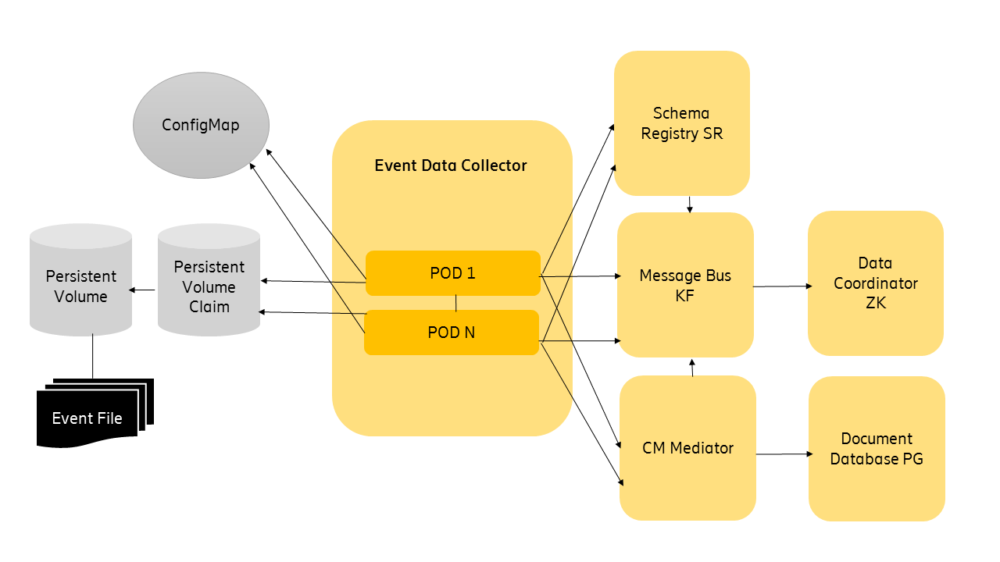

= Event Data Collector - Deployment Guide
:author: Donnacha Bushe
:doc-name: Event Data Collector - Deployment Guide
:doc-no: 1/1531-CAV 101 049/1
:revnumber: A
:revdate: {sys: date +%Y-%m-%d}
:approved-by-name: Mohamed Ibrahim C
:approved-by-department: BDGSBECA

== Function Overview
The **Event Data Collector** service parses events so that their data is readable by consuming applications. It works with Cell Trace Record (CTR) Recording Output Period (ROP) events that network nodes generate. These events are recorded in CTR ROP files.

=== Deployment Overview

The figure illustrates the deployment of the *Event Data Collector*
service in a kubernetes environment.

The service uses the *Schema Registry SR* service to look up the Apache
Avro schemas. These schemas are used to serialize parsed events.

* The *Event Data Collector* service relies on the *Message Bus KF* service to
provide the following:

** Input messages containing file paths.
** An output message which the **Event Data Collector** service populates with parsed modeled events.

* The **CM Mediator** service performs the following tasks:

** Manages the runtime configuration of the event filtering, which is
described in the event filtering chapter of the *Event Data Collector - Application Developer Guide* <<ref_1,1>>.
** Uses the **Document Database PG** service for configuration storage
** Uses the **Message Bus KF** service for notification updates

* The **Message Bus KF** service depends on the Data Coordinator ZK service
for coordination.
* The *Schema Registry SR* service relies on the Message Bus KF service to store the
schemas.
* Non-service related artefacts used by the *Event Data Collector* service
include the following:

** `ConfigMap` manages the event flow and input/output configuration.
** Persistent Volume Claim and Persistent Volume are used to configure
storage.

==== Prerequisites

* A running Kubernetes environment
* Some knowledge of the Kubernetes environment, including the networking
details
* Access rights to deploy and manage workloads
* Availability of the `kubectl` CLI tool with correct authentication
details. Contact the Kubernetes System Admin if needed
* Availability of the `helm` package.
* It is recommended to have the same version for both the client and the
server (tiller).
* Availability of Helm charts and Docker images for the service and all
dependent services.

== Deployment in a Kubernetes Environment Using Helm

This section describes how to deploy the service in Kubernetes using
Helm and the `kubectl` CLI client. Helm is a package manager for
Kubernetes that streamlines the installation and management of
Kubernetes applications.

=== Preparation

==== Ensure Helm Chart and Docker Image Access - Applicable to Internal Users

Use the following helm chart repository link to find the latest  event-data-collector.tgz release version.
----
https://arm.epk.ericsson.se/artifactory/proj-helm_aia-generic-local/releases/eric-event-data-collector/
----
You should have an URL as the following, make sure to replace "0.0.9--999" with the appropriate release number for the helm chart :
----
https://arm.epk.ericsson.se/artifactory/proj-helm_aia-generic-local/releases/eric-event-data-collector/eric-event-data-collector-0.0.9-999.tgz
----

==== Ensure Helm Chart and Docker Image Access - Applicable to External Users

External users who have access to the Software Gateway must complete the following steps:

. Download the following files from the Software Gateway:
* Helm chart: `19010-CXC2011896_1_X_A_TAR_GZIPV1.tar.gz`
* Docker image for Event Data Collector service: `19010-CXC2011895_1_X_A_TAR_GZIPV1.tar.gz`
* Docker image for JMX Exporter sidecar: `19010-CXC2012016_1_X_A_TAR_GZIPV1.tar.gz`

. Rename the docker image files from ".tar.gz" to ".zip"
+
. Unzip
`19010-CXC2011895_1_X_A_TAR_GZIPV1.zip` to get a docker
 image tar file `event-data-collector_<version>__CXC2011895.tar`
. Load the tar file:
+
----
 docker load --input event-data-collector_<version>__CXC2011895.tar
----
. Tag the loaded docker image and push the image to a repository for helm installation:
+
----
 docker tag armdocker.rnd.ericsson.se/aia_releases/event-data-collector:<version> <repository>/event-data-collector:<version>
----
+
----
 docker push <repository>/event-data-collector:<version>
----

. Unzip
`19010-CXC2012016_1_X_A_TAR_GZIPV1.zip` to get a docker
 image tar file `prometheus-jmx-exporter_<version>_CXC2012016-1.tar`
. Load the tar file:
+
----
 docker load --input prometheus-jmx-exporter_<version>_CXC2012016-1.tar
----
. Tag the loaded docker image and push the
 image
 to a repository for helm installation:
+
----
 docker tag armdocker.rnd.ericsson.se/aia_releases/prometheus-jmx-exporter-0.3.1:<version> <repository>/prometheus-jmx-exporter-0.3.1:<version>
----
+
----
 docker push <repository>/prometheus-jmx-exporter-0.3.1:<version>
----

==== Pre-Deployment Checks - Applicable to All Users

Ensure the following:

* The `<RELEASE_NAME>` is not used already in the corresponding cluster.
Use `helm list` command to list the existing deployments (and delete
previous deployment with the corresponding `<RELEASE_NAME>` if needed).
* The same namespace is used for all deployments.

==== Storage Requirements

The *Event Data Collector* service needs access to Cell Trace Record (CTR) files. These files must be visible to all instances of the service. One way of providing visibility is to mount a kubernetes volume for each instance of the service. The Kubernetes Storage Documentation <<ref_5,5>> lists available Volume types.

We recommend the use of Persistent Volumes for storage. For more
information, see the Kubernetes documentation on persistent storage.

Make sure the correct configuration parameters are used for the installation, to ensure the files are properly evaluated leave an empty line at the EOF to allow the complete yaml interpretation.

To use Persistent Volumes, complete the following steps:

.  Create the `MY_NAMESPACE.yaml` file with the following content.
Replace `<NAMESPACE>` with your namespace name. For more information,
see the Kubernetes documentation on creating a new namespace .
+
----
apiVersion: v1
kind: Namespace
metadata:
  name: <NAMESPACE>

----
.  Create the `NAMESPACE` by running the following kubectl command.
+
----
kubectl create -f ./MY_NAMESPACE.yaml
----
+
The output is as follows.
+
----
Namespace "<NAMESPACE>" created.
----
.  Create a Persistent Volumes file called `my-pv.yaml`. Replace
`<NFS SERVER>` with the NFS server address and `<EVENT FILE PATH>` with
the folder containing event files. The following example uses NFS
storage. Replace the relevant code to specify your storage type. For
details, refer to the Kubernetes documentation on persistent volumes.
+
----
apiVersion: v1
kind: PersistentVolume
metadata:
  name: event-data-collector-file-pv
spec:
  capacity:
    storage: 10Gi
  accessModes:
    - ReadWriteMany
  nfs:
    server: <NFS SERVER>
    path: "<EVENT FILE PATH>"
----
.  Create the Persistent Volumes by running the following `kubectl create`
command.
+
----
kubectl create -f ./my-pv.yaml
----
+
The output is as follows.
+
----
persistentvolume "event-data-collector-file-pv" created
----

. Confirm that the Persistent Volume has been created by running the `kubectl get` command.
+
----
kubectl get pv
----
+
The relevant output to check is as follows:
+
----
NAME                           ...    STATUS    ...  STORAGECLASS
event-data-collector-file-pv   ...    Available ...  erikube-cinder
----
. Create the Persistent Volume Claim file (`my-pvc.yaml`) file with
the following content.
+
----
apiVersion: v1
kind: PersistentVolumeClaim
metadata:
  name: event-data-collector-file-pv
spec:
  accessModes:
    - ReadWriteMany
  storageClassName: "<STORAGE CLASS NAME>"
  resources:
    requests:
      storage: 10Gi

----
+
Try the following command to look for a valid storage class name.
+
----
kubectl get storageclass
----

.  Create the Persistent Volume Claim by running the following
`kubectl create` command.
+
----
kubectl create -f ./my-pvc.yaml -n MY_NAMESPACE
----
+
The output is as follows:
+
----
persistentvolumeclaim "event-data-collector-file-pvc" created
----

. Confirm that the Persistent Volume has been created by running the `kubectl get` command.
+
----
kubectl get pvc
----
+
The relevant output to check is as follows:
+
----
NAME                           STATUS    VOLUME                         ...
event-data-collector-file-pvc  Bound     event-data-collector-file-pv   ...
----

=== Helm Chart Installation of Dependent Services

Make sure the correct configuration parameters are used for
installation. For example, use the correct parameter for `storageClass`.

. Run the below command to set target namespace as default one.
+
----
kubectl config set-context $(kubectl config current-context) --namespace=<NAMESPACE>
----
. Install the *Message Bus KF* Service. For instructions see the *Message Bus KF - Deployment Guide* <<ref_2,2>>.
. (Recommended) Install the *CM Mediator* service when using *CM Mediator*
for run-time configuration, for example filter configuration. For instructions
and background information, see the *CM Mediator - Deployment Guide* <<ref_3,3>>.
. Install the *Schema Registry SR* service. For instructions and
background information, see the *Schema Registry SR Deployment Guide* <<ref_4,4>>.

=== Helm Chart Installation of the Event Data Collector Service

*Note:* Ensure all dependent services are deployed and healthy before
you continue with this step (see previous chapter).

Users can override the default values provided in the values.yaml
template of the helm chart. The recommended parameters to override are
listed in the following section: <<configParams,Configuration Parameters>>.

==== Prerequisites

. Ensure that the *Message Bus KF* service is configured to provide topics `epsFileInput` and `epsOut`.
+
To create the required topics, complete the following tasks:
+
..  Generate a *Message Bus KF* test container to communicate with the
*Message Bus KF* cluster and the *Data Coordinator ZK* cluster, as shown.
+
----
kubectl run -it msgbus-test --image=armdocker.rnd.ericsson.se/aia_releases/message-bus-kf-1.0.1:1.0.0-8 --restart=Never --command -- bash -il
----
..  Create the topics by running the following commands in the test
container. Ensure that the partition size and replication-factor are
specified according to your needs.
+
----
root@msgbus-test:/# kafka-topics --create --zookeeper eric-data-coordinator-zk:2181/eric-data-message-bus-kf  --partitions 3 --replication-factor 3 --topic epsFileInput

root@msgbus-test:/# kafka-topics --create --zookeeper eric-data-coordinator-zk:2181/eric-data-message-bus-kf  --partitions 3 --replication-factor 3 --topic epsOut
----
+
*Note*
For optimum load balancing, we recommend that the number of partitions
in the Subscriber topic is exactly divisible by the following:

** The number of Message Bus KF brokers.
** The number of replicas of the Event Data Collector.

.  Ensure that schemas are imported into the *Schema Registry SR*
service. +
 +
Use the `kubectl run` command to import schemas, as shown:
+
----
kubectl run -it schema-importer --restart=Never --image=armdocker.rnd.ericsson.se/aia/ossbss-4464/schema-importer-avro -- -dir=/schemas -registry=http://schemaregistry:8081
----

=== Deploy the Event Data Collector Service

.  Create a yaml file called `my-volume.yaml` with the persistent
Volume claim information and mount information. The
`persistentVolumeClaim claimName` should be the same as the one created
in the Storage Requirements section.
+
----
volumes: |
  - name: event-data-collector-pmdata
    persistentVolumeClaim:
      claimName: event-data-collector-file-pv
volumeMounts: |
  - name: event-data-collector-pmdata
    mountPath: "/ctr_data"
    subPath: 15k96rop
    readOnly: true
----
. Deploy the *Event Data Collector* Service by issuing the following
`helm` command:
+
----
helm install --devel <CHART_REFERENCE> --name <RELEASE_NAME> --values my-volume.yaml
----
+
The variables specified in the command are as follows:
+
`<CHART_REFERENCE>`: A path to a packaged chart, a path to an unpacked
chart directory or a URL.
+
`<RELEASE_NAME>`: String value, a name to identify and manage your
helm chart.
+
Here is an example of the `helm install` command:
+
----
helm install --devel https://armdocker.rnd.ericsson.se/artifactory/proj-helm_aia-generic-local/releases/eric-event-data-collector/event-data-collector-0.0.9-999.tgz --name event-data-collector --namespace test-deployment-namespace --values my-volume.yaml
----

==== Verify the Availability of the Event Data Collector Service

To check for a successful deployment of the *Event Data Collector*
Service, do the following:

1.  Check if the helm chart is installed with the provided release name
and in the related namespace using the `helm ls` command.
+
----
helm ls -a <RELEASE_NAME>
----
+
The output is as follows:
+
----
NAME <RELEASE_NAME>
REVISION 1
UPDATED Fri Nov 23 12:12:13 2018
STATUS DEPLOYED
CHART event-data-collector-1.0.0-999
NAMESPACE <NAMESPACE>
----
+
Chart status should be *`DEPLOYED`* .

2.  Get the status of the installed helm chart to ensure that it is
deployed and that its pods are running:
+
----
helm status <RELEASE_NAME>
----
+
The output is as follows.
+
----
LAST DEPLOYED: Fri Nov 23 12:12:13 2018
NAMESPACE: <NAMESPACE>
STATUS: DEPLOYED
RESOURCES:
==> v1/ConfigMap
NAME DATA AGE
eric-event-data-collector-flow-config 5 5m
==> v1beta1/StatefulSet
NAME DESIRED CURRENT AGE
eric-event-data-collector 1 1 5m
==> v1/Pod(related)
NAME READY STATUS RESTARTS AGE
eric-event-data-collector-0 2/2 Running 0 5m
----
+
Chart status should be `DEPLOYED` and Pod status should be `Running`.

[[configParams]]
== Event Data Collector Service Configuration Parameters

The *Event Data Collector* Service uses a configuration interface based
on environment variables that are defined in the helm chart. You can set
these variables during the deployment of the helm chart (using the `--set`
argument). If not explicitly set, the default values provided in the
helm chart are used.

[width="100%",cols="25%,50%,25%",options="header",]
|=======================================================================
|Parameter |Description |Default
|`ctrParser.schemaRegistry.serviceProtocol` |The service protocol of the
Schema Registry SR service. |`http`

|`ctrParser.schemaRegistry.serviceName` |The service name of the
Schema Registry SR service. |`schemaregistry`

|`ctrParser.schemaRegistry.port` |The port number of the Schema
Registry SR service. |`8081`

|`ctrParser.applicationId` |The identifier that is used for the JVM
processes of the *Event Processing* service and for JMX metrics.
|`apeps`

|`ctrParser.applicationHome` |The base application folder of the
*Event Data Collector* service. |`/ericsson/apeps`

|`ctrParser.flowDirectory` |The directory containing the `flow.xml`
file. |`/ericsson/apeps/flow`

|`ctrParser.ctrParser.heap` |The initial heap size of the *Event
Data Collector* service. |`1500M`

|`ctrParser.maxHeap` |The maximum heap size of the *Event Data
Collector* service. |`1500M`

|`ctrParser.livenessProbeInitialDelaySeconds` |The number of seconds
that kubelet waits before performing the first health check probe for
the eps container. |`5`

|`ctrParser.livenessProbePeriodSeconds` |How frequently, in seconds,
Kubelet checks the health of the eps container. |`5`

|`ctrParser.readinessProbeInitialDelaySeconds` |The number of seconds
that kubelet waits before performing the first service availability
check probe the eps container. |`5`

|`ctrParser.readinessProbePeriodSeconds` |The frequency, in seconds,
that Kubelet checks the service availability of the eps container. |`5`

|`ctrParser.cpu` |The CPU resources required by the
`event-data-collector` container. |`150m`

|`ctrParser.maxCpu` |The CPU limit for the `event-data-collector`
container. |`250m`

|`ctrParser.memory` |The memory resources required by the
`event-data-collector` container. |`1500M`

|`ctrParser.maxMemory` |The memory limit for the `event-data-collector`
container. |`2500M`

|`ctrParser.logging.logbackConfFile` |The directory containing the
log configuration |`/ericsson/apeps/etc/logback/xml`

|`ctrParser.logging.logDirectory` |The directory storing the log files
of the Event Data Collector. |`/ericsson/apeps/log`

|`ctrParser.instrument.instrumentationOn` |Enables metrics reporting
if set to TRUE. |`TRUE`

|`ctrParser.instrument.instrumentationMethod` |The type of metrics
used. `JMX` is the default. Other available options are: `CSV` and
`SLF4J`. |`JMX`

|`ctrParser.instrument.instrumentationFileLocation` |The directory
that stores metrics files if
`ctrParser.instrument.instrumentationMethod` is set to `CSV`.
|`/ericsson/apeps/reporting`

|`ctrParser.instrument.jmx.destPort` |The port where the *Event Data
Collector* service exposes JMX metrics if
`ctrParser.instrument.instrumentationMethod` is set to `JMX`. |`10000`

|`ctrParser.instrument.jmx.servicePort` |The port where metrics for
the *Event Data Collector* service are exposed in readable format for
the *PM Server* service. |`21000`

|`ctrParser.instrument.jmx.rules` |The jmx ruleset to be used - by
default, the jmx default ruleset that captures all exposed metrics is
used. |`default`

|`ctrParser.instrument.jmx.livenessProbeInitialDelaySeconds` |The
number of seconds that kubelet waits before performing the first health
check probe on the jmx container. |`180`

|`ctrParser.instrument.jmx.livenessProbeTimeoutSeconds` |The number of
seconds after which the liveness probe times out on the jmx container.
|`10`

|`ctrParser.instrument.jmx.readinessProbeInitialDelaySeconds` |The
number of seconds that kubelet waits before performing the first service
availability check for the jmx container. |`60`

|`ctrParser.instrument.jmx.readinessProbeTimeoutSeconds` |The number
of seconds after which the readiness probe times out on the jmx
container. |`5`

|`ctrParser.instrument.jmx.cpu` |The CPU resources required by the jmx
container. |`5m`

|`ctrParser.instrument.jmx.maxCpu` |The CPU limit for the jmx
container. |`5m`

|`ctrParser.instrument.jmx.memory` |The memory required by the jmx
container. |`128Mi`

|`ctrParser.instrument.jmx.maxMemory` |The memory limit for the jmx
container. |`192Mi`

|`ctrParser.flow.flowFile` |The name of the flow.xml file for the
*Event Data Collector* service. |`flow.xml`

|`ctrParser.flow.flow.xml` |The configuration details of the flow.xml
file. |For more information, regarding the flow file, see the **Configuration Values** chapter of the *Event Data Collector - Application Developer Guide* <<ref_1,1>>.

|`ctrParser.ipl.iplPath` |The path to the Integration Point Library
configuration files. |`/ericsson/apeps/flow`

|`ctrParser.ipl.subscriber.subscriberFile` |The name of the event
subscriber file. a|`SUBSCRIBER_INTEGRATION_POINT.json`

|`ctrParser.ipl.subscriber.subscriberFileContent` |The configuration
details of the `ctrParser.ipl.subscriber.subscriberFile`. |For more
information, regarding the SUBSCRIBER_INTEGRATION_POINT.json file, see the **Configuration Values** chapter of the *Event Data Collector - Application Developer Guide* <<ref_1,1>>.

|`ctrParser.ipl.subscriber.cmMediator_subscriberFile` |The name of the
`cmMediator` subscriber file. a|`CMMEDIATOR_SUBSCRIBER_INTEGRATION_POINT.json`

|`ctrParser.ipl.subscriber.cmMediator_subscriberFileContent` |The
configuration details of the
`ctrParser.ipl.subscriber.cmMediator_subscriberFile.` |For more
information, regarding the SUBSCRIBER_INTEGRATION_POINT.json file, see the **Configuration Values** chapter of the *Event Data Collector - Application Developer Guide* <<ref_1,1>>.

|`ctrParser.ipl.publisher.publisherFile` |The name of the publisher
file. a|`PUBLISHER_INTEGRATION_POINT.json`

|`ctrParser.ipl.publisher.publisherFileContent` |The configuration
details of the `ctrParser.ipl.publisher.publisherFile.` |For more
information, regarding the PUBLISHER_INTEGRATION_POINT.json file, see the **Configuration Values** chapter of the *Event Data Collector - Application Developer Guide* <<ref_1,1>>.

|`ctrParser.ipl.eventFilterFile` |The name of the local file that
stores a list of events to be sent to the publisher.
|`eventListFilter.json`

|`ctrParser.ipl.eventFilterFileContent` |The configuration details of
the `ctrParser.ipl.eventFilterFile`. |For more information, regarding
the event.json file, see the **Configuration Values** chapter of the *Event Data Collector - Application Developer Guide* <<ref_1,1>>.
|=======================================================================

== Event Data Collector Service Scaling

The *Event Data Collector* Service supports manual scaling. Event Data
Collector load balances using a Message Bus KF consumer group.

For optimum load balancing, we recommend that the number of partitions
in the Subscriber topic is exactly divisible by the following:

* The number of Message Bus KF brokers.
* The number of replicas of the Event Data Collector.

Scaling is achieved using the `helm upgrade` command, for example:

----
helm upgrade --devel <RELEASE_NAME> <CHART_REFERENCE> --set replicas=4 --values my-volume.yaml
----

The variables specified in the command are as follows:

* `<RELEASE_NAME>`: String value, a name to identify and manage your
helm chart.
* `<CHART_REFERENCE>`: A path to a packaged chart, a path to an unpacked chart directory or a URL.

It can take up to 5 minutes for Event Data Collector to refresh the
Message Bus KF topic metadata. This means that new partitions are not
consumed from or published to until this timeout has passed.

== Event Data Collector Service Upgrade Procedure
[[Upgrade]]
=== Upgrade

The *Event Data Collector* Service supports upgrade without loss of
persistent service configuration data.

In Kubernetes, you can upgrade the Helm chart to migrate the Event Data
Collector Service from the existing version to a higher version.

.  Check if the *Event Data Collector* service is installed in the
system with a specific chart version.
+
----
helm ls
----
+
The output should show that *Event Data Collector* Service is installed,
has a release name and a specific chart revision, and has a chart status
of `DEPLOYED`.

.  Migrate to a higher version using the `helm upgrade` procedure.
+
----
helm upgrade --devel <RELEASE_NAME> <CHART_REFERENCE> --values <VALUES YAML FILE>
----
+
Replace the following variable with values:
+
`<RELEASE_NAME>`: String value, a name to identify and manage your
helm chart.
+
`<CHART_REFERENCE>:` A path to a packaged chart, a path to an unpacked
chart directory or a URL to upgrade to.
+
`<VALUES YAML FILE`>: A path to a `values.yaml` file
+
The output should indicate that Release `<RELEASE_NAME>` has been
upgraded.
+
The following is an example of the `helm upgrade` command.
+
----
helm upgrade --devel event-data-collector https://armdocker.rnd.ericsson.se/artifactory/proj-helm_aia-generic-local/releases/eric-event-data-collector/eric-event-data-collector-0.0.9-999.tgz --values my_values.yaml
----

=== Post Upgrade Verification

To check if the upgrade succeeded, complete the following steps:

. Check if the upgrade of the chart with the provided release name and
in the related namespace using helm ls command +
+
----
helm ls
----
+
The chart status should be reported as DEPLOYED.

. Verify the status of the helm chart by getting the status for your
chart for which upgrade is done: +
+
----
helm status <RELEASE_NAME>
----
+
The chart status should be reported as DEPLOYED and Pod status should be
reported as Running.

. Verify that the Event Data Collectors have successfully updated in
Message Bus KF.

.. Log in to any of your Message Bus KF pods:
+
----
kubectl exec -it <YOUR MESSAGE BUS KF POD> /bin/bash
----
.. List the consumers related to the consumer group:
+
`epsFileConsumerGrp` is the name of the consumer group given in the
configuration file provided in the Configuration Values chapter of the *Event Data Collector - Application Developer Guide* <<ref_1,1>>.
+
----
kafka-consumer-groups  --bootstrap-server eric-data-message-bus-kf:9092 --describe --group epsFileConsumerGrp
----
+
The columns to check in the relevant output are as follows:
+
----
TOPIC                          PARTITION  ...  HOST                           CLIENT-ID
epsFileInput                   0          ...  /192.168.26.244                consumer-1
----
+
The output shows each connected consumer and the related partition and
topic. The IP given in the `HOST` column matches the IPs assigned to the
*Event Data Collector* pod(s).

[bibliography]
== References
[bibliography]
* [[ref_1]] 1. Event Data Collector - Application Developer Guide docno:[1/198 17-CAV 101 049/1]
* [[ref_2]] 2. Message Bus KF - Deployment Guide docno:[1/1531-CAV 101 19/1]
* [[ref_3]] 3. CM Mediator - Deployment Guide docno:[1/1531-CAV 101 18/1]
* [[ref_4]] 4. Schema Registry SR - Deployment Guide docno:[1/1531-CAV 101 66/1]
* [[ref_5]] 5. https://kubernetes.io/docs/concepts/storage/
