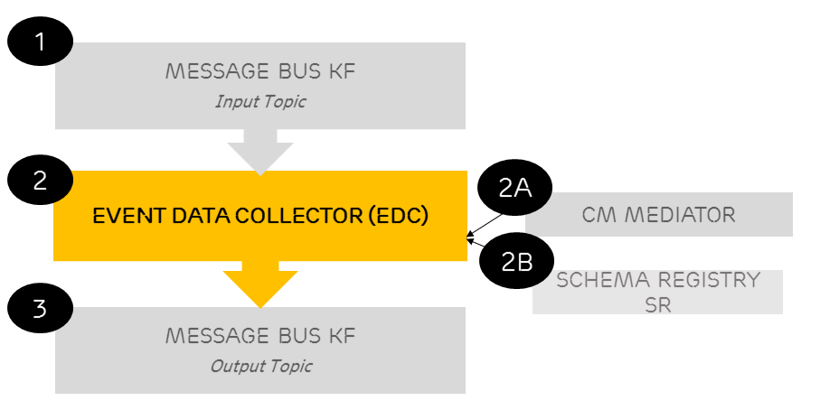
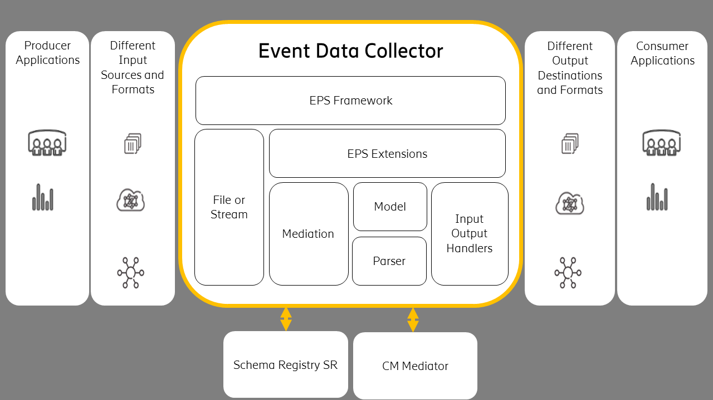

= Event Data Collector - Service Overview
:author: Donnacha Bushe
:doc-name: Event Data Collector - Service Overview
:doc-no: 1/1551-CAV 101 049/1
:revnumber: A
:revdate: {sys: date +%Y-%m-%d}
:approved-by-name: Mohamed Ibrahim C
:approved-by-department: BDGSBECA

== Overview

This document provides an overview of the **Event Data Collector** (EDC) service. It gives a brief description of its main features and its interfaces.

The **EDC** service parses events so that their data is readable by consuming applications. It works with Cell Trace Record (CTR) Recording Output Period (ROP) events that network nodes generate. These events are recorded in CTR ROP files.

The process flow is as follows:

. Processed CTR ROP files are added to a **Message Bus KF** input topic that stores the paths to the ROP files on a shared storage location.

. The **EDC** service consumes the CTR ROP file paths on the input topic, decodes the CTR events, and pushes the CTR events to the **Message Bus KF** output topic.

.. It references the **CM Mediator** service to filter by CTR event.

.. It references the relevant schemas in the **Schema Registry SR** service to serialize the CTR events.

. The **Message Bus KF** output topic receives the CTR events.

For more details, links to other documents are provided.

== Architecture

The current release of **EDC** service supports the process flow described in the Overview section of this document.
The **EDC** service is based on the **Event Processing Service (EPS)** Framework. This means that the solution can be extended to support the following:

- Different input sources and formats as well as different output destinations and formats.
+
Examples include but are not limited to the following: JDBC data store, Active MQ Messaging System, and Hadoop Distributed File System (HDFS).
- The possibility of first decoding and then parsing event file types other than CTR files.
+
This can be accomplished by implementing new parsers and providing the parser-specific model files.

The diagram represents the EDC service roadmap architecture. The community is encouraged to contribute in by collaborating with the EDC core service team.

Internally, the **EDC** service is composed of sub-modules. The **EPS Extensions** framework submodule encapsulates the **Input Output Handlers** as well as the **Mediation** layer.

In the EDC core, the **Parser** submodule is mainly responsible for decoding events. It relies on the following:

- The **Model** module references the standard XML models for node events. These standard models are used to unpack the events binary files incoming from the node.
- Services such as **CM Mediator** provide centralized dynamic run-time configuration for events filtering.
- Services such as **Schema Registry SR** store Apache Avro schemas.

== Deployment

// Describe supported deployment methods, one or several instances supported, how it scales etc>
The **EDC** service is packaged as a Docker container. It supports deployment in Kubernetes using Helm.

To deploy the Service, refer to the Deployment Guide (see <<Ref_1>>). This guide:

* Explains how to get started using the **EDC** Service in the supported environments.
* Specifies configuration options for starting the **EDC** docker container.

If problems occur when using the service, refer to the Troubleshooting guide (see <<Ref_2>>).

[bibliography]
References
----------

[bibliography]
* [[Ref_1]] **Event Data Collector** Service Deployment Guide doc-no:[1/1531-CAV 101 049/1]
* [[Ref_2]] **Event Data Collector** Service Troubleshooting Guide doc-no:[1/15451-CAV 101 049/1]
